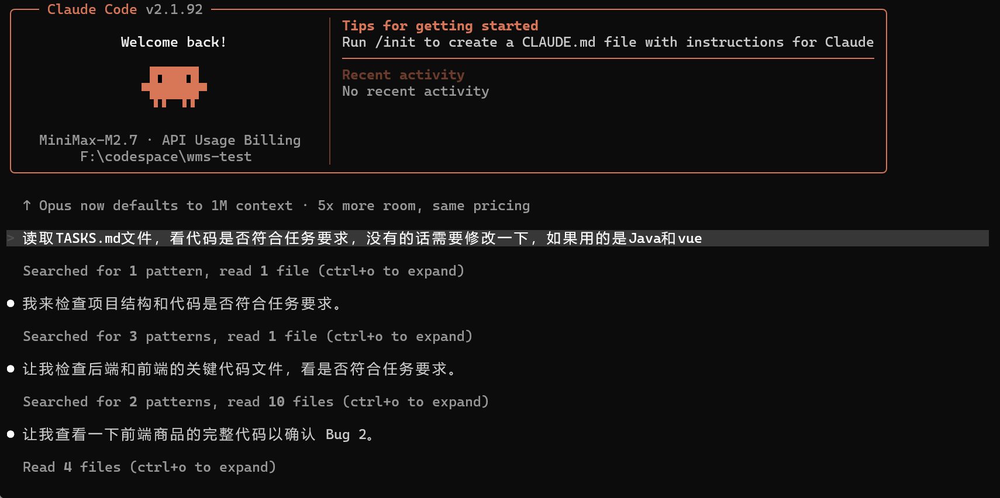
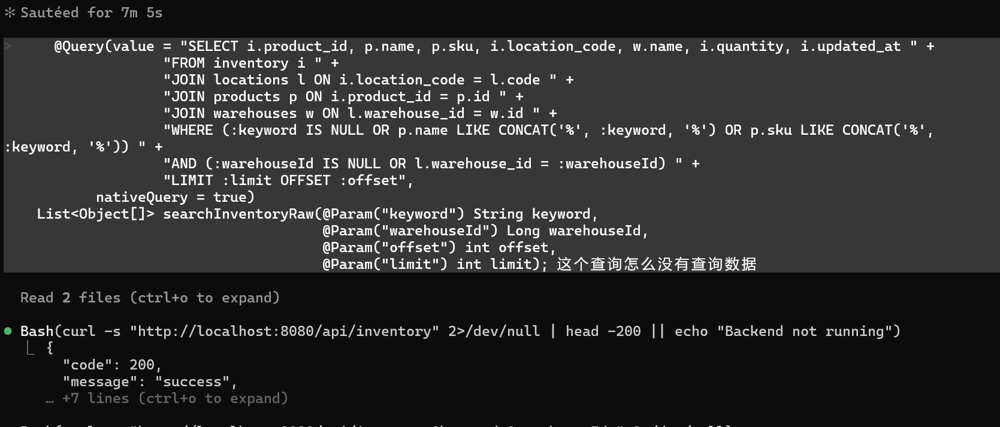
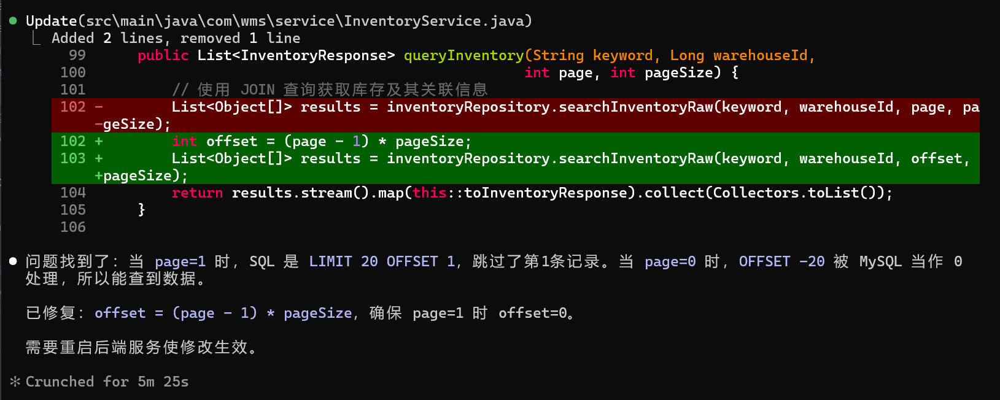

1. 你使用了哪些 AI 工具？如何使用的？ 
- 使用了Claude Code+MiniMax2.7（免费体验）进行开发，前端工具使用了字节公司的Trae开发工具；
- 通过cli的方式与AI对话，任务完成后，再手动确认是否引入代码； 

2. 遇到了什么问题？如何解决的？ 
- 使用AI进行开发，代码存在bug需要修复，前后端进行联调，然后定位问题，问题找到后，可使用AI帮助修复，然后进行测试，最后进行代码提交；

3. 如果有更多时间，你还会做什么？ 
- 统一后台字段名称，同一个字段命名，在不同表中命名一致
- 将查询参数，请求参数使用实体来接收，是代码清晰简洁
- 统计返回响应格式，将对应的魔法值统一成枚举类或常量
- 调整页面样式，当前页面略显简陋